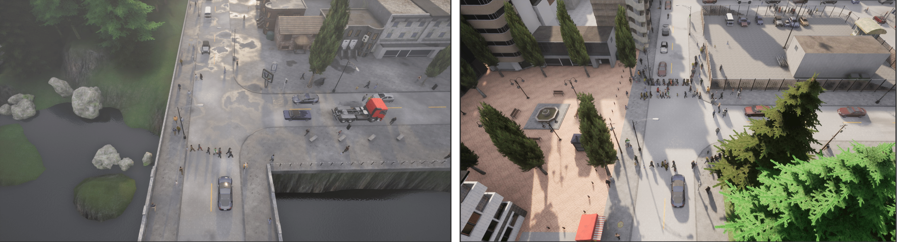

  

This repository contains the Pareto-based version of the Revolve CARLA experiments.
It runs CARLA simulations for multiple individuals and evaluates them with a multi-objective SMS-EMOA style evaluator.

python3 -m venv venv  
source venv/bin/activate  
pip install -r requirements.txt  

The main evaluation loop is in loop.sh.  
It launches CARLA, runs each individual through main.py, and restarts the simulator between runs.  
bash loop.sh

