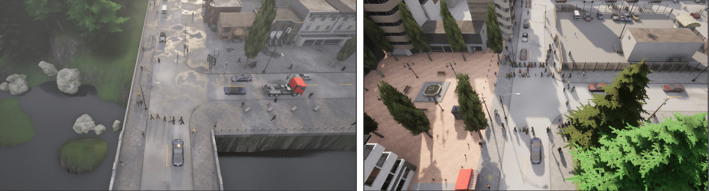

# Pareto-Based Revolve CARLA Experiments

<p align="center">
  
</p>

This repository contains the Pareto-based version of the Revolve CARLA experiments. It runs CARLA simulations for multiple individuals and evaluates them with a multi-objective SMS-EMOA-style evaluator.

## Videos

### Pareto Policy

<p align="center">
  <video src="media/Pareto_Policy.mp4" width="700" controls muted playsinline>
    Your browser does not support the video tag.
  </video>
</p>

[Open Pareto_Policy.mp4](media/Pareto_Policy.mp4)

### YOLO-Based Perception

<p align="center">
  <video src="media/Pareto_yolo.mp4" width="700" controls muted playsinline>
    Your browser does not support the video tag.
  </video>
</p>

[Open Pareto_yolo.mp4](media/Pareto_yolo.mp4)

## Setup

```bash
python3 -m venv venv
source venv/bin/activate
pip install -r requirements.txt
```

## Running

The main evaluation loop is in `loop.sh`. It launches CARLA, runs each individual through `main.py`, and restarts the simulator between runs.

```bash
bash loop.sh
```

## Repository Structure

```text
.
├── loop.sh
├── main.py
├── requirements.txt
└── media
    ├── Pareto_Policy.mp4
    ├── Pareto_yolo.mp4
    └── carla_combined-1.png
```

## Notes

The videos show the CARLA policy behaviour and the YOLO-based perception component used in the Pareto-based evaluation setup.
